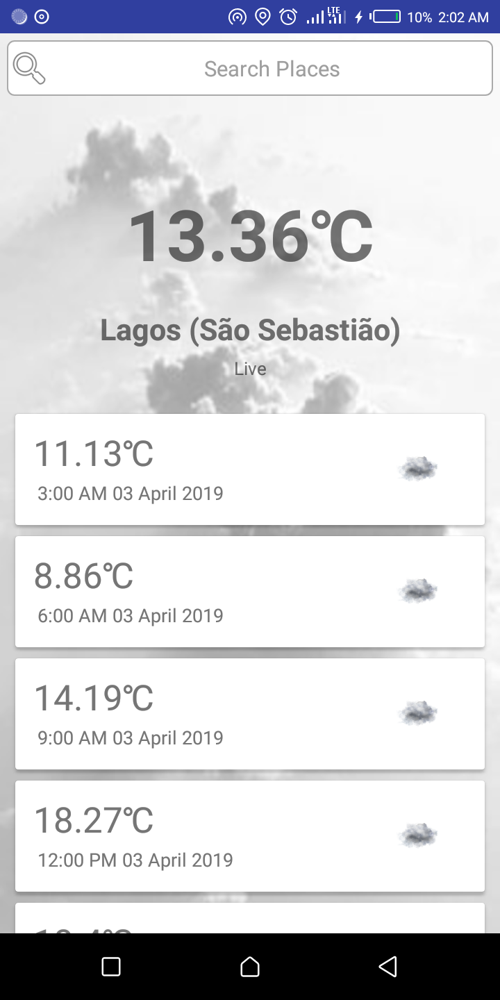

# MVVM Sample App
A simple application that shows MVVM sample implementation using the  MVVM Architectural
components 
- LiveData 
- ViewModel
- Lifecycle

Other Tools used:
- Retrofit2
- Open Weather REST API
- DataBinding, etc

